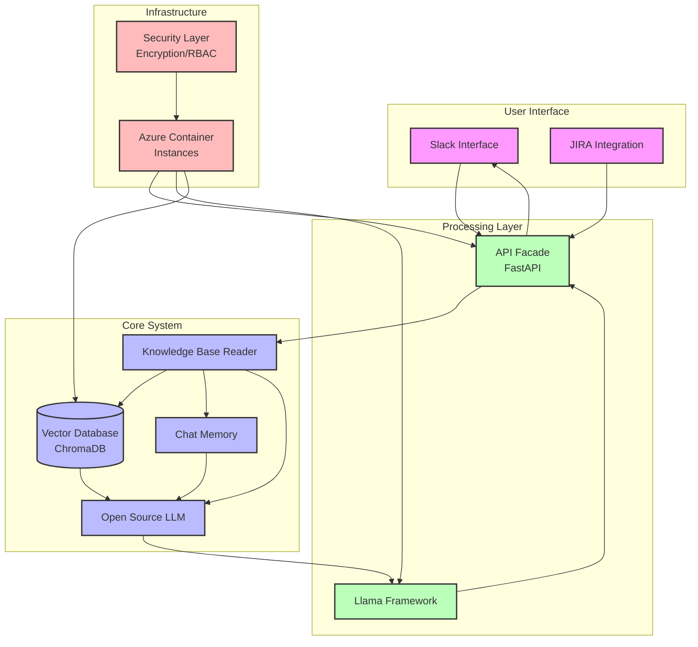

# Solution Architecture

## Architecture Components

1. **User Interface Layer**
   - Slack Interface: Primary I/O for user interactions
   - JIRA Integration: Task management and project data source

2. **Core System**
   - Knowledge Base Reader: Manages data retrieval and processing
   - Chat Memory: Stores conversation context
   - Open Source LLM: Processes queries and generates responses
   - Vector Database (ChromaDB): Stores vectorized data for semantic search

3. **Processing Layer**
   - API Facade (FastAPI): Routes and manages requests
   - Llama Framework: Hosts and serves LLM endpoints

4. **Infrastructure Layer**
   - Azure Container Instances: Hosts all components
   - Security Layer: Implements encryption and RBAC

## Data Flow

1. User submits query via Slack
2. API Facade routes request to Knowledge Base Reader
3. Knowledge Base Reader:
   - Retrieves relevant vectors from ChromaDB
   - Gets historical context from Chat Memory
   - Sends enriched query to LLM
4. LLM processes query through Llama Framework
5. Response returned to user via Slack

## Security Features

- End-to-end encryption
- Role-based access control (RBAC)
- Secure API management
- Azure Container Instance security

## Integration Points

- Slack API for user interaction
- JIRA API for task management
- Vector database for semantic search
- Chat Memory for context awareness
